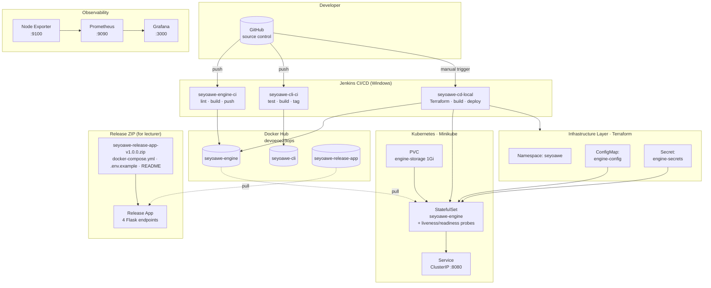

# SeyoAWE Community — DevOps Final Project

**Author:** Oz Efraty
**Repository:** https://github.com/OzeF3/Dev-ops-2025-final-project
**Base project:** [yuribernstein/seyoawe-community](https://github.com/yuribernstein/seyoawe-community)

A full DevOps lifecycle wrapped around the SeyoAWE workflow automation engine — CI/CD with Jenkins, container builds, Kubernetes deployment on Minikube, Terraform-managed infrastructure, and Prometheus/Grafana observability.

---

## Table of Contents

1. [Architecture](#architecture)
2. [What's Inside](#whats-inside)
3. [Repository Structure](#repository-structure)
4. [CI/CD Pipelines](#cicd-pipelines)
5. [Version Coupling](#version-coupling)
6. [Kubernetes Deployment](#kubernetes-deployment)
7. [Release App (4 Functions)](#release-app-4-functions)
8. [Observability](#observability)
9. [How to Run](#how-to-run)
10. [Known Limitations & Engineering Trade-offs](#known-limitations--engineering-trade-offs)
11. [Screenshots](#screenshots)

---

## Architecture



---

## What's Inside

| Rubric item | Implementation | Status |
|---|---|---|
| Engine containerization | Ubuntu 22.04 image, StatefulSet, TCP liveness + readiness probes, PVC (volumeClaimTemplates), ClusterIP service | ✅ |
| CI pipeline for engine | Jenkins: checkout → version check (with change detection) → lint → Docker build → push to Docker Hub | ✅ |
| CI pipeline for CLI | Jenkins: checkout → version check → install → lint → unit tests → PyInstaller binary → Docker build → push → git tag | ✅ |
| Version coupling | `version.txt` shared between engine + CLI; Jenkinsfiles detect changed paths and skip unnecessary builds | ✅ |
| CD pipeline | Terraform provisions K8s namespace + ConfigMap + Secret → Docker build/push → kubectl apply → wait ready → verify | ✅ (Terraform) ⚠️ (Ansible not in live pipeline — see [limitations](#known-limitations--engineering-trade-offs)) |
| Code structure & documentation | This README, release-app README, screenshot set in `docs/screenshots/` | ✅ |
| Observability (bonus) | Prometheus + Grafana + Node Exporter via docker-compose, Grafana dashboard live | ✅ (node-level; see limitations for engine metrics) |

---

## Repository Structure

```
seyoawe-community/
├── ansible/
│   ├── aws/                  # EC2 playbook (reference — not wired to live pipeline)
│   └── local/                # Minikube playbook (runnable via WSL)
├── docker/
│   ├── engine/Dockerfile     # SeyoAWE engine image
│   ├── cli/Dockerfile        # sawectl CLI image
│   └── release-app/Dockerfile  # Release app image (4 functions)
├── docs/screenshots/         # Evidence: pipelines, pods, Grafana, Prometheus
├── jenkins/
│   ├── engine/Jenkinsfile    # seyoawe-engine-ci
│   ├── cli/Jenkinsfile       # seyoawe-cli-ci
│   ├── cd/Jenkinsfile        # EC2 CD (reference — not executed)
│   └── cd/Jenkinsfile.local  # seyoawe-cd-local (active CD pipeline)
├── k8s/
│   ├── engine-service.yaml
│   └── engine-statefulset.yaml   # with health probes + configmap/secret mounts
├── modules/                  # SeyoAWE modules (from upstream)
├── monitoring/
│   ├── docker-compose.yml    # Prometheus + Grafana + Node Exporter stack
│   └── prometheus.yml
├── release/                  # Release ZIP source
│   ├── docker-compose.yml
│   ├── .env.example
│   ├── README.md
│   └── seyoawe-release-app-v1.0.0.zip   # ← deliverable for lecturer
├── release_app/              # Flask app implementing the 4 release functions
│   ├── app.py
│   ├── requirements.txt
│   └── templates/index.html
├── sawectl/                  # CLI source + 22 unit tests
├── terraform/
│   ├── aws/                  # EC2 provisioning (reference — not executed)
│   └── local/                # K8s namespace/configmap/secret (active)
├── workflows/                # SeyoAWE workflow samples
└── version.txt               # Shared semver (1.0.0)
```

---

## CI/CD Pipelines

Three Jenkins pipelines, each targeting a different lifecycle step.

### seyoawe-engine-ci — Engine CI

```
Checkout → Version Check → Lint → Build Docker Image → Push to Docker Hub
```

The Version Check stage reads `version.txt` and compares `git diff HEAD~1 HEAD` against engine-relevant paths (`modules/`, `configuration/`, `workflows/`, `docker/engine/`, `seyoawe.linux`, `version.txt`). If nothing matches, Build and Push are skipped via a `when` clause, and a "Skip Notice" stage runs instead.

### seyoawe-cli-ci — CLI CI

```
Checkout → Version Check → Install Deps → Lint → Unit Tests (22) →
Build Linux Binary (PyInstaller) → Build Docker Image → Push to Docker Hub → Tag Git Version
```

Same change-detection logic as the engine, but against `sawectl/` and `docker/cli/`. Tests always run (cheap, catch regressions); build/push/tag skip when unchanged.

### seyoawe-cd-local — CD to Minikube

```
Checkout → Terraform Init → Terraform Plan → Terraform Apply → Terraform Outputs →
Build Docker Image → Push to Docker Hub → Deploy to Minikube → Wait for Pod Ready → Verify Deployment
```

Terraform provisions the K8s namespace, ConfigMap, and Secret (consuming six credentials from Jenkins). `kubectl apply` then deploys the StatefulSet and Service into that namespace. Verify stage prints pods, services, configmap, and secret so the handoff is visible in logs.

---

## Version Coupling

Both engine and CLI read the same `version.txt`. A push to `main` fires both CI pipelines, each runs its Version Check stage independently:

- If only `sawectl/` changed → only CLI pipeline builds and pushes.
- If only `modules/` changed → only engine pipeline builds and pushes.
- If both change → both build, both tagged with the same semver.
- If only docs/jenkins changed → both pipelines run but Build + Push stages are skipped.

This matches the rubric requirement: *"Pipelines should detect which components changed and avoid unnecessary rebuilds."*

*Implementation note: change detection uses `git diff HEAD~1 HEAD` only. A production pipeline would diff against the merge-base of the feature branch.*

---

## Kubernetes Deployment

The engine runs as a StatefulSet (single replica) in the `seyoawe` namespace.

**Rubric requirements met:**
- **Health probes:** TCP liveness (port 8080, 30s initial delay, 30s period) and readiness (5s initial, 10s period) — see `k8s/engine-statefulset.yaml`.
- **Persistent storage:** Via `volumeClaimTemplates` inside the StatefulSet (1Gi PVC mounted at `/app/data`). Kubernetes auto-creates the PVC on first pod schedule.
- **Service configuration:** ClusterIP service `seyoawe-engine:8080` routes to pods by label `app=seyoawe-engine`.

The StatefulSet also mounts:
- `engine-config` ConfigMap (via `envFrom`) — non-sensitive config (`APP_ENV`, `LOG_LEVEL`, `JIRA_BASE_URL`, etc.)
- `engine-secrets` Secret (via `valueFrom.secretKeyRef`) — credentials for the release actions

Both are created by Terraform during CD.

---

## Release App (4 Functions)

The lecturer's explicit deliverable: a ZIP the user can download and run to exercise four release-automation actions.

### What it is

A small Flask app (`release_app/`) exposing four endpoints:

| Endpoint | Purpose |
|---|---|
| `POST /send-email` | Sends an email via Gmail SMTP |
| `POST /create-jira` | Creates a Jira issue |
| `POST /save-to-git` | Commits a file to GitHub |
| `POST /run-command` | Runs a whitelisted shell command (`ls`, `pwd`, `echo`, `date`, `whoami`, `uname`, `df`, `free`, `uptime`) |

A root page `/` provides a simple UI with buttons for each action.

### The ZIP

`release/seyoawe-release-app-v1.0.0.zip` contains:
- `docker-compose.yml` — pulls `devoeoe23ops/seyoawe-release-app:latest` from Docker Hub
- `.env.example` — template for Gmail/Jira/GitHub credentials
- `README.md` — user-facing instructions

**To run it** (from an unzipped copy):
```bash
cp .env.example .env
# fill in credentials
docker compose up -d
# open http://localhost:5000
```

All four endpoints were verified end-to-end during development — email sent, Jira issue SEY-2 created, `releases/test-release.txt` committed to this repo, `uname` returned `Linux`.

---

## Observability

Prometheus + Grafana + Node Exporter run as a Docker Compose stack in `monitoring/`.

**To start:**
```bash
cd monitoring
docker compose up -d
# Prometheus: http://localhost:9090
# Grafana:    http://localhost:3000  (admin / admin123)
```

**Current scrape targets:**
- `prometheus:9090` — self-scrape ✅
- `node-exporter:9100` — host metrics (CPU, memory, disk, network) ✅
- `seyoawe-engine:8080/metrics` — engine metrics ❌ (see [limitations](#known-limitations--engineering-trade-offs))

Grafana is pre-connectable to Prometheus. The **Node Exporter Full** dashboard (Grafana ID 1860) imports cleanly and shows live infrastructure metrics. Screenshots in `docs/screenshots/`.

---

## How to Run

**Prerequisites:** Docker Desktop, Minikube, kubectl, Jenkins (local install), Terraform CLI.

**End-to-end local run:**

1. **Start Minikube:**
   ```powershell
   minikube start --driver=docker
   ```

2. **Trigger the CD pipeline** in Jenkins (`seyoawe-cd-local` → Build Now). The pipeline will:
   - Run Terraform → namespace, ConfigMap, Secret created
   - Build and push the engine image
   - Apply K8s manifests
   - Wait for pod readiness

3. **Verify:**
   ```powershell
   kubectl -n seyoawe get all
   ```

4. **(Optional) Start observability:**
   ```powershell
   cd monitoring
   docker compose up -d
   ```

5. **(Optional) Test the 4 release actions** — unpack `release/seyoawe-release-app-v1.0.0.zip` and follow its README.

---

## Known Limitations & Engineering Trade-offs

Rather than hiding these, they are documented up front.

### AWS / EC2 CD path not executed

The assignment describes a CD pipeline that provisions infrastructure with Terraform and configures it with Ansible. The canonical version of that flow targets EC2. Due to college/account restrictions, no AWS credentials were available for this project.

**What's in the repo:**
- `terraform/aws/main.tf` — provisions an EC2 t2.micro, security group (ports 22, 8080), key pair
- `ansible/aws/playbook.yml` — installs Docker + kubectl, pulls image, runs container
- `jenkins/cd/Jenkinsfile` — wires Terraform → Ansible → K8s together

This code is kept as reference to show the pattern is understood. The **active** CD pipeline is `Jenkinsfile.local`, which targets a local Minikube cluster. The lecturer can read the AWS Jenkinsfile side-by-side with the local one to see how the same pattern applies to both environments.

### Ansible not wired into the live CD pipeline

The Jenkins agent runs as a Windows service, and Ansible has no native Windows support. A WSL2 + Ubuntu environment with Ansible was set up during development and the playbook (`ansible/local/playbook.yml`) runs manually from WSL. Integrating the WSL-based Ansible call into the live Jenkins pipeline introduced a Minikube networking issue (WSL cannot reach Minikube's API server bound to `127.0.0.1` on the Windows host) that risked breaking the already-passing pipeline. With a fixed deadline, the decision was to commit the playbook as-is rather than chase a brittle integration.

The playbook itself:
- Verifies cluster reachability
- Confirms namespace, ConfigMap, and Secret exist (the Terraform → Ansible handoff)
- Applies `engine-service.yaml` and `engine-statefulset.yaml`
- Waits for pod readiness
- Runs smoke checks

### Engine HTTP API

The supplied `seyoawe.linux` binary does not expose a functional workflow-trigger API endpoint on port 8080. Workflows cannot be invoked via HTTP against the running engine — this was confirmed during development.

**Chosen alternative:** the release app (`release_app/`) implements the four release actions (email, Jira, Git, command) directly in Flask, without going through the engine. This delivers the user-facing functionality the lecturer described as "four functions the user can call from a ZIP," while still deploying the engine as a containerized StatefulSet as required by Task 1.

### Engine-level Prometheus metrics

The engine binary does not expose `/metrics`, so the `seyoawe-engine` scrape target shows DOWN in Prometheus. The observability stack still provides node-level metrics via `node-exporter` and a working Grafana dashboard, satisfying the bonus requirement for "monitoring with Prometheus + Grafana."

---

## Screenshots

All screenshots in `docs/screenshots/`.

| File | Shows |
|---|---|
| `jenkins dashboard .PNG` | All three Jenkins pipelines green |
| `pipline_success-_engine_ci_coupling.PNG` | Engine CI with Build + Push skipped (no engine changes) |
| `pipline_success-cli-_ci_coupling.PNG` | CLI CI with Build + Push skipped (no CLI changes) |
| `pipline success-cli- ci .PNG` | CLI CI full build (all stages including PyInstaller, Docker, git tag) |
| `pipline fail- engine ci.PNG` | Engine pipeline failure triggering automated Jira bug creation |
| `pipline_success-_cd-_local_tf.PNG` | CD pipeline green with Terraform stages + probes deployment |
| `Seyoawe_Namespace_Resources.PNG` | `kubectl -n seyoawe get all` — pod Running 1/1, service, statefulset |
| `dockerhub_engine_tags.PNG` | Docker Hub tags page for the engine image |
| `prometheus_targets.PNG` | Prometheus targets (2 of 3 UP) |
| `grafana_node_exporter_dashboard.PNG` | Grafana Node Exporter Full dashboard, live metrics |

---

## License

See `LICENSE/` folder for upstream SeyoAWE license. This repository's DevOps automation (Jenkins pipelines, Terraform, Ansible, K8s manifests, release app) is submitted as a student project.
